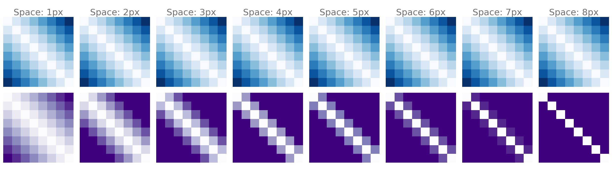
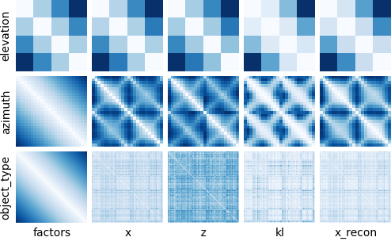
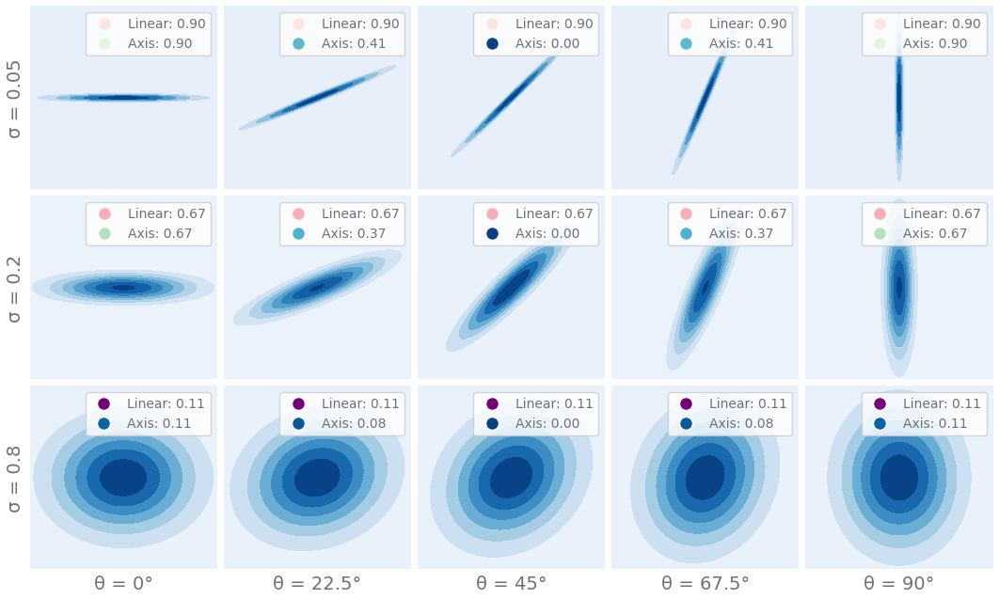

<p align="center">
    <h1 align="center">🧵 MSc. Research</h1>
    <h2 align="center">Disentanglement Using VAEs Resembles Distance Learning and Requires Overlapping Data</h2>
</p>

<p align="center">
    <i>This research has been built using the <a href="https://github.com/nmichlo/disent">disent</a> framework</i>
    </br>
    <i>The version of disent included in this repo is frozen at <a href="https://github.com/nmichlo/disent/releases/tag/v0.4.0">v0.4.0</a></i>
</p>
<p align="center">
    <a href="https://choosealicense.com/licenses/mit/" target="_blank">
        
    </a>
    <a href="https://github.com/nmichlo/msc-research/actions?query=workflow%3Atest">
        
    </a>
</p>

----------------------

## Table Of Contents

- [Contributions](#contributions)
    * [Datasets](#datasets)
    * [Frameworks](#frameworks)
    * [Metrics](#metrics)
- [Architecture](#architecture)

----------------------

### Citing This Work

Please use the following citation if you use this **research** in your own work:

```bibtex
@article{michlo2022data,
  title={Data Overlap: A Prerequisite For Disentanglement},
  author={Michlo, Nathan and James, Steven and Klein, Richard},
  journal={arXiv preprint arXiv:2202.13341},
  year={2022}
}
```

Please use the following citation if you use <a href="https://github.com/nmichlo/disent">disent</a> in your own research:

```bibtex
@Misc{Michlo2021Disent,
  author =       {Nathan Juraj Michlo},
  title =        {Disent - A modular disentangled representation learning framework for pytorch},
  howpublished = {Github},
  year =         {2021},
  url =          {https://github.com/nmichlo/disent}
}
```

----------------------

## Contributions

My MSc research includes creation of the (disent)[https://github.com/nmichlo/disent] framework which implements models, metrics and
datasets from various papers relating to disentanglement. The framework itself is highly configurable and customizable. 

_We contribute the following "🧵" frameworks, metrics and datasets as part of my research._

### Datasets

We contribute four new synthetic datasets, each with various settings that can be adjusted. Each dataset is designed
to highlight key issues with learning disentangled representations with VAEs:

1. VAEs learn distances over the data according to the reconstruction loss measured between raw datapoints.
   We call these distances the **_perceived distances_** of VAEs.
   XYSquares highlights this issue as the distance between each observation is constant in terms of a pixel-wise loss
   function! A VAE cannot order elements in the latent space because of this and disentanglement does not occur!

   &nbsp;

   + <details open>
     <summary>
       🧵 <u>XYSquares</u>:
       <i>Three non-overlapping squares that can move around a grid. This dataset is <b>adversarial</b> for disentanglement when pixel-wise reconstruction losses are used for VAEs.</i>
     </summary>
     <p align="center"></p>
   </details>
    
   &nbsp;

   **FIX**: _A simple way to remedy this problem and improve disentanglement is by changing to a reconstruction loss that can
   re-capture the distances between observations such ground-truth distances are captured, OR by changing the spacing between
   grid-points such that squares once again overlap and the pixel-wise loss can now capture the ground-truth distances. In the
   case of this XYSquares dataset, a loss function that would introduce overlap is for example augmenting the observations passed
   to a pixel-wise loss function with some type of blurring operation._
    
   &nbsp;

   + <details>
     <summary>
       <u>Example! Changing Spacing</u>:
       <i>Adjusting the spacing of gridpoints for this dataset affects overlap and improves disentanglement.</i>
     </summary>
     <p align="center"></p>
     <p align="center"><i>Blue represents the average matrix of ground-truth distances over factor traversals measured using the L1 distance (Just for reference). Purple represents the perceived distance matrix along the same ground-truth factor traversals when changing the spacing between gridpoints as measured using the pixel-wise MSE.</i></p>
   </details>

   &nbsp;

2. Disentanglement is subjective. Different representations of ground-truth factors can be chosen for the same task,
   eg. RGB versus HSV colour spaces in images.
   If the ground-truth distances between observations do not correspond to the perceived distances between observations
   (according to the reconstruction loss of the VAE), then disentanglement performance suffers. Different choices of
   ground-truth factors can make disentanglement tasks easier.

   &nbsp;

   + <details>
     <summary>
       🧵 <u>XYObject</u>:
       <i>A simplistic version of dSprites with a single square.</i>
     </summary>
     <p align="center"></p>
   </details>

   + <details open>
     <summary>
       🧵 <u>XYObjectShaded</u>:
       <i>Exact same dataset as XYObject, but ground truth factors have a different representation. <b>Disentanglement is subjective</b>: If ground-truth factors do not align with distances in the dataspace, disentanglement performance suffers!</i>
     </summary>
     <p align="center"></p>
   </details>

   &nbsp;

3. The desired ground-truth factors can be masked by external ground-truth factors that
   we do not care about. These factors affect the distances learnt by VAEs. Simply incorporating real world noise into
   an existing synthetic dataset can drastically hinder disentanglement performance. Adjusting the strength of this noise
   can improve or hinder disentanglement performance too.

   &nbsp;

   + <details open>
     <summary>
       🧵 <u>dSpritesImagenet</u>:
       <i>Version of DSprite with foreground or background deterministically masked out with tiny-imagenet data. <b>External factors can mask desired ground-truth factors!</b></i>
     </summary>
     <p align="center"></p>
   </details>

### Frameworks

We contribute the following supervised and unsupervised VAE frameworks.

**Supervised**:
  + <u>Ada-TVAE</u> a supervised disentanglement framework that can learn disentangled representations from a distance
    function used as a supervision signal. Combining metric learning, specifically triplet loss, and using ideas from
    the [Ada-GVAE](https://arxiv.org/abs/2002.02886), which estimates which variables are shared between two different
    representations.

**Unsupervised**:
  + <u>Ada-TVAE (unsupervised)</u>: The same as the _Ada-TVAE_, but the supervision signal is replaced with some distance function
    between raw datapoints. Using this approach, there is an upper bound on how disentangled representations can be. Some datasets
    are more conducive to this than others depending on how well the ground-truth distances between observations aligns with the
    distances between datapoints.

### Metrics

We propose multiple metrics for measuring how well a VAE has learnt disentangled/factored representations by learning
distances over the data. These metrics measure three properties. To obtain disentangled/factored representations all
three properties need to be satisfied. VAEs usually only satisfy the first two properties, but only accidentally satisfy
the third if unsupervised.

1. **_Ground-Truth Correlation_**: between Ground-Truth and Latent Distances

   - Perceived distances over the data according to the chosen reconstruction loss of the VAE should correspond to
     distances between ground-truth factors of the observations themselves. This metric measures the Spearman rank
     correlation coefficient between these corresponding distances.

   &nbsp;

   <p align="center"></p>
   <p align="center"><i>VAEs learn distances in the latent space (z) that correspond to distances in the data space (x) as measured by the reconstruction loss. The distances between ground-truth factors of the factor traversals used to computed these average distance matrices are given on the left (factors). These average distance matrices for each ground-truth factor are computed over the Cars3D dataset. See <a href="https://github.com/nmichlo/msc-research/blob/main/README_DISENT.md">README_DISENT.md</a>. <b>Some factors naturally correlate more with ground-truth distances. This implies datasets are accidentally disentangled!</b></i></p>

   &nbsp;

2. **_Linearity ratio_**: of representations in the latent space

   - If we encode a series of observations that correspond to a single ground-truth factor traversal, where only the
     target factor is changed, but the rest remain fixed. Then corresponding representations encoded by the VAE should
     lie along some arbitrary n-dimensional line in the latent space. This metric measures how well these encoded points
     correspond to a single n-dimensional line by performing PCA over the encoded values and taking the max eigenvalue
     over the sum of eigenvalues. This can be seen as taking the variance along the n-dimensional line which best describes
     the points over the sum of the variances of all the perpendicular lines that are additionally needed to represent the points.
     A score of 1 is good, all the points can be represented by a single n-dimensional line. A score of 0 is bad and the encodings
     need many axes to represent them.

   &nbsp;

3. **_Axis-alignment ratio_**: of representations in the latent space

   - Like the linearity ratio, this metric encodes observations that lie along the same factor traversals. The variance of
    each latent unit of the resulting encodings are then computed. The max variance is taken over the sum of all variances.
    This metric makes sure that the factor traversal is encoded by a single latent unit indicating the resulting representations are factored.
     But not necessarily ordered according to the correlation above. Note that the axis-alignment ratio is bounded above by the linearity ratio.
   If a good linearity ratio is obtained, the latent space just needs to be rotated to obtain a good axis-alignment ratio.

   &nbsp;

   <p align="center"></p>
   <p align="center"><i>A comparison of the linearity and axis-alignment ratios for samples of points in a 2D space. With differing widths and rotations for the distributions that the points are sampled from.</i></p>


----------------------

## Architecture

This repo is the uncleaned frozen version of <a href="https://github.com/nmichlo/disent/releases/tag/v0.4.0">disent v0.4.0</a>.
- Originally, to generate the disent versions, we used the script `prepare_release.sh` to remove all research related code from
  the `xdev` branch before being merged into the `dev` branch.
- This repo has simply not performed this cleaning process before merging the `xdev` branch into `dev` and `main`.

**Disent Structure**: _Please see the architecture for disent under the _Architecture_ section._
- `/disent`:     See the [architecture for disent](https://github.com/nmichlo/msc-research/blob/main/README_DISENT.md)
- `/experiment`: See the [architecture for disent](https://github.com/nmichlo/msc-research/blob/main/README_DISENT.md)
- `/tests`:      See the [architecture for disent](https://github.com/nmichlo/msc-research/blob/main/README_DISENT.md)
- `/docs`:       See the [architecture for disent](https://github.com/nmichlo/msc-research/blob/main/README_DISENT.md)

**Research Structure**: _All research related files are contained in `/research`_
- `research.code` - contains the experimental additions to the disent framework. The package structure mirrors that of disent.
    + `research.code.dataset`: Additional ground-truth datasets
    + `research.code.frameworks`: Additional experimental frameworks
    + `research.code.metrics`: Additional disentanglement metrics
    + `research.code.util`: Additional helper code
- `research/config`: Hydra config files that override or complement those from `experiment/config`
- `research/part*`: Collections of scripts for running experiments and generating plots
- `research/scripts` Helper scripts for running experiments in a generic way on the University of the Witwatersrand's computing cluster. These can be adapted for custom use.

----------------------
